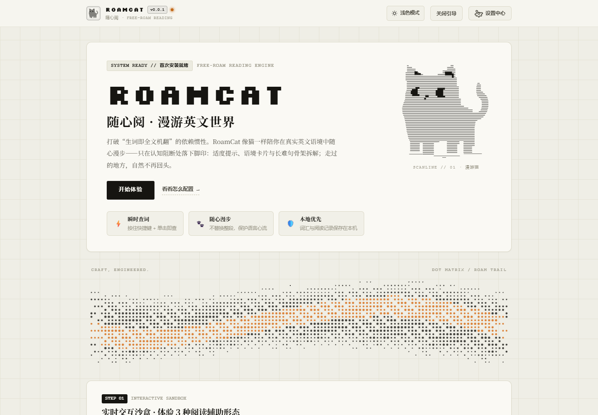
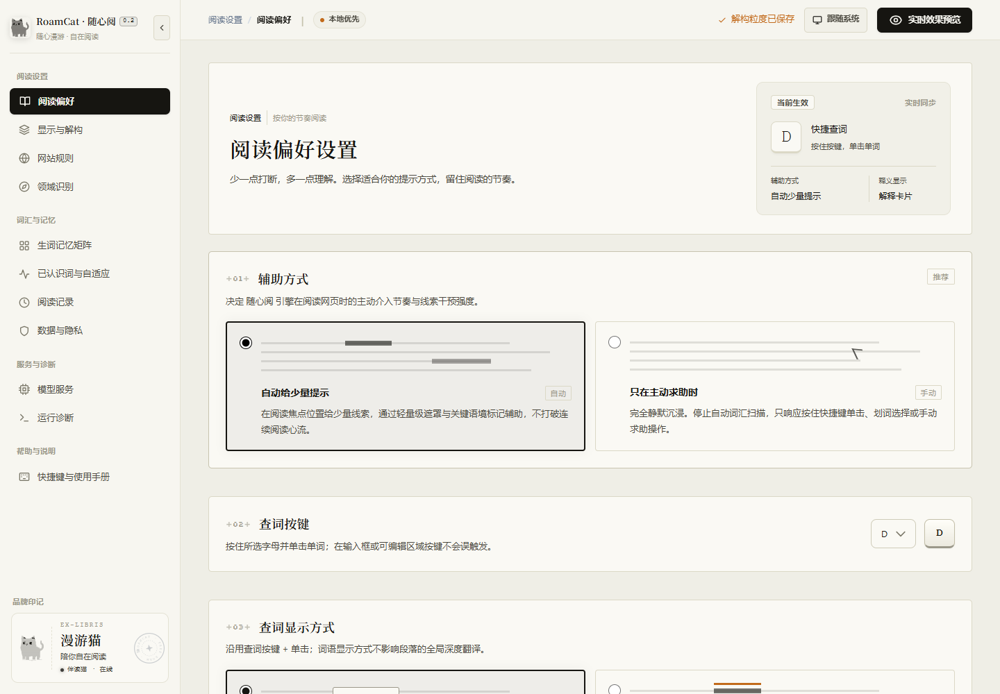

<p align="center">
  
</p>

<h1 align="center">RoamCat · 随心阅</h1>

<p align="center">
  <strong>像猫一样漫游英文世界的双模式阅读扩展</strong><br/>
  双语翻译把页面英文原位译成中英对照；阅读辅助保留原文，只给稀疏提示与按需救援。
</p>

<p align="center">
  <a href="https://img.shields.io/badge/license-MPL--2.0-blue"></a>
  <a href="https://github.com/dapao-777/roamcat/releases"></a>
  
  
</p>

<p align="center">
  <a href="https://github.com/dapao-777/roamcat/releases">下载预发版</a> ·
  <a href="#快速开始">安装指南</a> ·
  <a href="roamcat-0.2.0/README.md">产品文档</a> ·
  <a href="roamcat-0.2.0/SPEC.md">工程规范</a>
</p>

> 当前为 0.0.1 预发布版：开发者模式加载，未上架商店。

> 本项目是对开源项目 [RelyLess](https://github.com/rockythink/relyless) 的重构、优化与修复，感谢原作者 B 站 UP 主 [停车拾穗](https://live.bilibili.com/392612)。

**本地优先**：不经营服务器、不采集遥测、阅读历史默认关闭且按站授权。AI 能力来自你自选的服务——内置本地分类模型、26 家自备 API 之一，或本机 ChatGPT / Grok / Antigravity 订阅连接器。

<p align="center">
  
</p>

## 两种模式，一个引擎

| | 🌐 双语翻译 · 主模式 | 📖 阅读辅助 · 副模式 |
|---|---|---|
| **做什么** | 页面英文原位译成中英对照 | 保留英文，只给稀疏提示与按需救援 |
| **怎么用** | 弹窗「翻译本页」或 `Alt+Shift+T`，随阅读位置推进，不后台预译整篇 | 自动少量提示渐退减量；按住 `D` + 单击查词；划词 / 选段手动救援 |
| **呈现** | 正文段落原位对照，表格卡片原位对应；导航、侧栏等页面构件以行内小字呈现译文 | 查词卡片 / 顶部词注 / 句子解构下划线；失败段落单独重试 |
| **退出** | 「返回英文」只移除扩展插入物，不回滚站点更新 | 提示随读随消，目标是逐渐不再需要提示 |

**🐱 伴读猫**：趴在页边的 Shadow DOM 挂件——阅读开关、文章摘要、设置与快捷键入口；可拖拽贴边，每页一只，未启用时完全不注入。

## 模型服务，自选来源

- **自备 API**：26 家服务商、8 种协议（OpenAI / DeepSeek / Gemini / Anthropic / Grok / OpenRouter / Ollama / 阿里云 / 火山 / Kimi / 阶跃……），结构化输出能力先探测后降级。
- **订阅连接器**：本机 Native Messaging 复用官方 CLI 权益——Codex CLI（ChatGPT 订阅）、Grok CLI（SuperGrok / X Premium+）、Antigravity `agy`（Google AI Pro / Ultra）。
- **本地模型**：内置 `Xenova/all-MiniLM-L6-v2` 在离屏文档 + Worker 中做页面领域识别，不联网、无需下载。

## 本地优先的边界

- 阅读记录默认关闭且按站授权，无痕页面不采集；API Key 只存 `chrome.storage.local`。
- 密钥不进内容脚本、诊断日志或连接器；内容脚本仅可用 33 种白名单消息。
- 模型输出全部经 `gloss.mjs` 结构化校验才进入 UI；自定义 API 地址强制 HTTPS（仅本机回环允许 HTTP）。

<p align="center">
  
</p>

## 快速开始

### 方式 A：Release 压缩包（最快，免构建）

到 [Releases](https://github.com/dapao-777/roamcat/releases) 下载 `roamcat-0.0.1-extension.zip` 并解压，`chrome://extensions` → 开启开发者模式 →「加载已解压的扩展」→ 选择解压出的 `extension` 目录。

> zip 产物未注入固定 key，扩展 ID 随安装路径生成；使用订阅连接器需按其安装流程绑定实际 ID。

### 方式 B：源码构建（推荐开发用，扩展 ID 固定）

```sh
npm ci
npm run build    # → dist/extension（dev 构建，manifest 注入固定 key）
```

加载 **`dist/extension`**。dev 构建的扩展 ID 由 `build/extension-key.json` 固定（当前 `afpeggkplomdjjiemgajjgcajieincng`），移动构建目录不影响 ID，连接器无需重装。改过源码后重新 `npm run build`，在扩展管理页点重新加载，再刷新已打开的网页。

### 方式 C：直接加载源目录（免构建）

选择 **`roamcat-0.2.0/extension`** 加载。注意：未打包扩展的 ID 与目录路径绑定，移动目录会改变 ID 并使本机连接器失效。

### 可选：订阅连接器

让扩展调用本机已登录的 ChatGPT / Grok / Antigravity CLI：

```sh
node roamcat-0.2.0/connector/install.mjs --extension-id <扩展ID> --backend grok
```

## 架构

```
┌─────────────────────────── 浏览器 ───────────────────────────┐
│ 内容脚本（manifest 静态四件套，document_idle）                  │
│   design.js → reading-style.js → content-ui.js → content.js   │
│   · content-ui.js：lit-html 页内 UI 渲染层（构建产物入库）      │
│   · content.js：阅读区识别 / 标注 / 查词 / 解构 / 双语翻译引擎   │
│ 动态注册（chrome.scripting，按需注入）                          │
│   · floating-pet.js 伴读猫挂件 · auto-start.js 自动开启         │
├──────────────────────────────────────────────────────────────┤
│ Service Worker：background.js（ES module，无状态）              │
│   71 种消息路由 · 设置校验迁移 · 缓存/并发/看门狗 · 订阅端口      │
├──────────────────────────────────────────────────────────────┤
│ 扩展页面：popup / options / welcome                            │
│   src/ 下 Lit 应用经 Vite 构建进 dist/extension/ui/            │
│ 离屏文档：local-inference（ONNX MiniLM 领域分类，5 分钟空闲销毁） │
├──────────────────────────────────────────────────────────────┤
│ 本机连接器（Node.js 20+，Native Messaging stdio 帧协议）         │
│   host.mjs + codex.mjs / grok.mjs / antigravity.mjs            │
└──────────────────────────────────────────────────────────────┘
```

工程要点：

- **信任边界**：扩展页（受信）→ 内容脚本（33 种白名单消息）→ 模型输出（结构化校验后才进 UI）→ 网页 DOM（以数据身份进提示词，`SOURCE_DATA_INSTRUCTIONS`）。
- **消息协议唯一事实源**：`extension/message-protocol.js` 登记全部 71 种消息与载荷解析器，注册表与处理器一一对应，有源码契约测试强制。
- **Service Worker 无内存态假设**：跨调用状态落在 `chrome.storage.local/session` 与 IndexedDB；写操作串行化，长操作带看门狗。
- 完整规范见 [`roamcat-0.2.0/SPEC.md`](roamcat-0.2.0/SPEC.md)。

## 路线图

以下为规划方向，可能随进展与反馈调整，不构成承诺：

- 主 / 副模式在阅读中的一键切换交互。
- 阅读辅助覆盖更多载体（副模式方向）：PDF、电子阅读器。
- `host_permissions` 由全站改为 `optional_host_permissions` 按需申请。
- Chrome Web Store / Microsoft Edge Add-ons 上架（文案与权限理由已备于 [`CHROMEWEBSTORE.md`](roamcat-0.2.0/CHROMEWEBSTORE.md)）。

## 开发

要求 Node.js 20.11+（Node 24 已验证）。静态检查与单测均为零依赖：

```sh
npm run build          # Vite 开发构建 → dist/extension（注入固定 key）
npm run build:watch    # watch 模式持续构建
npm run verify         # 模块图门禁 R1–R11：加载契约 / 无环 / 分层方向 / 文件头 / manifest 资源
npm test               # 单元测试（node --test，Node 18+ 通用）
npm run verify:build   # 构建产物门禁：字节比对 + Edge 实际加载冒烟
npm run gen:tokens     # 由 src/tokens.css 重新生成 extension/design.js
```

本机浏览器回归（需要 Playwright + 本机 Edge，产出到 `preview/`）：

```sh
node tools/audit-extension.cjs    # 主回归
node tools/verify-ui.cjs          # UI 布局与明暗主题
```

贡献前请读 [CONTRIBUTING.md](CONTRIBUTING.md)；安全漏洞请私下报告，见 [SECURITY.md](SECURITY.md)。

<details>
<summary><strong>仓库布局</strong></summary>

| 路径 | 内容 |
|------|------|
| [`roamcat-0.2.0/extension/`](roamcat-0.2.0/extension/) | Manifest V3 扩展源层：background、内容脚本、领域模块、本地推理、icons/fonts/_locales，及 Lit 应用共用的 `ui/` 模块与样式（经典页面源由构建产物替代）。 |
| [`roamcat-0.2.0/connector/`](roamcat-0.2.0/connector/) | Native Messaging 宿主 + Codex / Grok / Antigravity 三个订阅 CLI 适配。 |
| [`src/`](src/) | Vite + Lit 页面应用与共享组件；`src/content-ui` 为页内 UI lit-html 渲染层；`@ext` 别名指向扩展源目录。 |
| [`build/`](build/) | 构建期脚本：扩展拷贝/manifest 变换插件、design tokens 生成、dev 扩展 key；`vite.content-ui.config.mjs` 为 content-ui IIFE 构建。 |
| `dist/extension/` | 构建产物（不入库）= 源层拷贝 − `REPLACED_BY_BUILD` + Vite 页面产物 + 变换后的 manifest。 |
| [`roamcat-0.2.0/README.md`](roamcat-0.2.0/README.md) | 产品说明：功能、安装、模型服务配置与隐私。 |
| [`roamcat-0.2.0/SPEC.md`](roamcat-0.2.0/SPEC.md) | 工程规范：消息协议、存储、安全边界、测试门禁。 |
| [`roamcat-0.2.0/docs/`](roamcat-0.2.0/docs/) | 设计系统等专项文档。 |
| [`roamcat-0.2.0/PRIVACY.md`](roamcat-0.2.0/PRIVACY.md) | 隐私政策正文。 |
| [`roamcat-0.2.0/CHROMEWEBSTORE.md`](roamcat-0.2.0/CHROMEWEBSTORE.md) | 上架文案、逐权限理由、隐私披露检查单。 |
| [`tools/`](tools/) | 模块图门禁、单元测试、构建产物门禁、本机浏览器回归脚本。 |

</details>

## 致谢与项目渊源

RoamCat 基于 [RelyLess](https://github.com/rockythink/relyless) 重构而来——本项目在其开源代码与产品理念之上做了重构、优化与修复（双模式引擎、Vite + Lit 页面构建链、整页双语翻译、订阅连接器等均为此基础上的工作）。

原作者为 B 站 UP 主 **[停车拾穗](https://live.bilibili.com/392612)**，感谢其开源工作。RelyLess 原仓库未附带许可声明，本仓库自有代码以 MPL-2.0 发布；若上游补充许可要求，本项目将遵循。

## 许可

自有代码采用 [MPL-2.0](LICENSE)。词频数据（CC BY-SA 4.0）、模型与运行时（Apache-2.0 / MIT）、图标（MIT）等第三方资产保留各自许可，见 [NOTICE.txt](roamcat-0.2.0/NOTICE.txt)。
