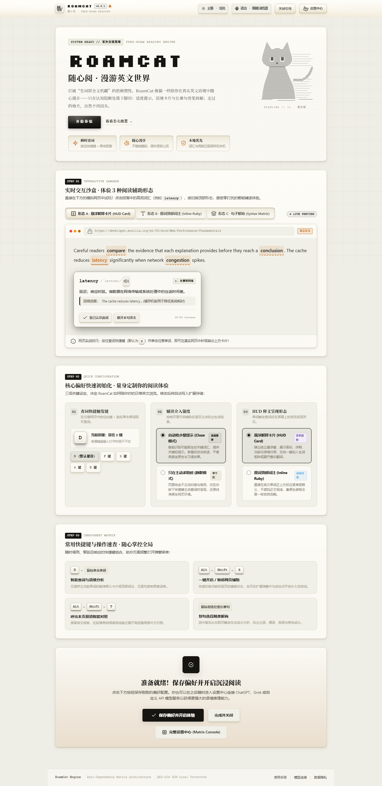
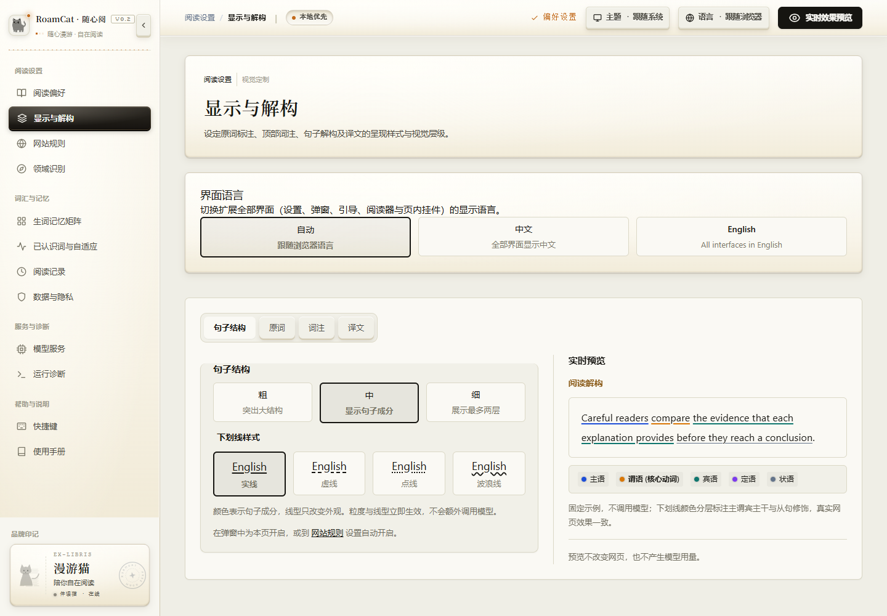

<p align="center">
  
</p>

<h1 align="center">RoamCat · 随心阅</h1>

<p align="center">
  <strong>A dual-mode reading extension that roams the English web like a cat</strong><br/>
  Bilingual mode translates English pages into side-by-side Chinese-English text; Reading Assistance keeps the original English and gives only sparse hints plus on-demand rescue.
</p>

<p align="center">
  <a href="https://img.shields.io/badge/license-MPL--2.0-blue"></a>
  <a href="https://github.com/dapao-777/roamcat/releases"></a>
  <a href="https://github.com/dapao-777/roamcat/actions/workflows/ci.yml"></a>
  
  
</p>

<p align="center">
  <a href="README.zh-CN.md">中文</a> ·
  <a href="https://github.com/dapao-777/roamcat/releases">Download prerelease</a> ·
  <a href="#quick-start">Install guide</a> ·
  <a href="roamcat-0.0.1/README.md">Product docs (中文)</a> ·
  <a href="roamcat-0.0.1/docs/design-system.md">Design docs (中文)</a> ·
  <a href="roamcat-0.0.1/SPEC.md">Engineering spec (中文)</a>
</p>

> This is the 0.0.1 prerelease: loaded via developer mode, not yet published on any store.

> This project is a refactor, optimization, and repair of the open-source project [RelyLess](https://github.com/rockythink/relyless). Thanks to the original author, Bilibili creator [停车拾穗](https://live.bilibili.com/392612).

**Local-first**: no servers operated, no telemetry, reading history off by default and gated per site. AI capability comes from a service you choose — a built-in local classification model, one of 28 bring-your-own API providers, or a local connector that reuses your ChatGPT / Grok / Antigravity subscription.

<p align="center">
  
</p>

## Two modes, one engine

| | 🌐 Bilingual Translation · Primary | 📖 Reading Assistance · Secondary |
|---|---|---|
| **What it does** | Translates page English in place into Chinese-English pairs | Keeps the English; sparse hints plus on-demand rescue only |
| **How to use** | Popup "Translate this page" or `Alt+Shift+T`; progresses with your reading position, never pre-translates the whole article in the background | Automatic sparse hints that taper off; hold `D` + click to look up a word; select a phrase or passage for manual rescue |
| **Display** | Body paragraphs get inline bilingual pairs; tables and cards are matched in place; navigation, sidebars, and other page chrome get small inline translations | Lookup card / top-of-line glosses / sentence-deconstruction underlines; failed passages retry individually |
| **Exit** | "Back to English" removes only extension-injected content, without rolling back site updates | Hints fade as you read — the goal is to stop needing them |

**🐱 Companion cat**: a Shadow DOM widget that perches at the page edge — reading switch, article digest, settings and shortcut entries; draggable and dockable to the edge; one per page; never injected unless enabled.

## Model services — your choice of source

- **Bring-your-own API**: 28 providers across 8 protocols (OpenAI / DeepSeek / Gemini / Anthropic / Grok / OpenRouter / Ollama / Alibaba Cloud / Volcano Engine / Kimi / StepFun…), with structured-output capability probed first, then gracefully degraded.
- **Subscription connector**: local Native Messaging reuses your official CLI entitlements — Codex CLI (ChatGPT subscription), Grok CLI (SuperGrok / X Premium+), Antigravity `agy` (Google AI Pro / Ultra).
- **Local model**: bundled `Xenova/all-MiniLM-L6-v2` runs page-domain classification in an offscreen document + worker — fully offline, nothing to download.

## Local-first boundaries

- Reading history is off by default and opt-in per site; nothing is collected on incognito pages; API keys live only in `chrome.storage.local`.
- Keys never enter content scripts, diagnostic logs, or the connector; content scripts can only send 33 whitelisted message types.
- All model output passes `gloss.mjs` structured validation before reaching the UI; custom API endpoints must be HTTPS (HTTP allowed for loopback only).

<p align="center">
  
</p>

## Design language

**Paper & ink × pixels × soft skeuomorphism**: cream paper `#faf9f4` + warm ink `#161511`, the Silkscreen pixel font and a scanline cat add a digital accent; controls are keycaps with physical feedback — buttons have bottom-edge skirts and sink on press, toggles are milled ceramic beads, badges are engraved plates. The dark theme is graphite lacquer + amber gold.

| Item | Spec |
|---|---|
| UI body text | System sans (Segoe UI / PingFang SC / Microsoft YaHei), 14–15px |
| Reading text & headings | Serif (Noto Serif SC → SimSun → Georgia), body 15px / 1.6 line-height |
| Brand / digits / keycaps | Silkscreen pixel font (bundled woff2, works offline) |
| Tags / POS / diagnostic codes | ui-monospace, 13px |
| Palette | Paper `#faf9f4` + ink `#161511` in light mode (ink doubles as the accent); graphite `#0b0e13` + ivory `#ece7d9` + amber `#f0a63c` in dark |
| Logo & marks | Scanline cat (`icons/roamcat.svg` + `roamcat-cat-ink.svg`, `fill="currentColor"`), dot-wave band, pixel spark |
| Motion | 80 / 160 / 280 / 440ms tiers + `linear()` spring curves, honors `prefers-reduced-motion` |

All visual decisions collapse into a single set of `--rc-*` tokens in `src/styles/tokens.css`; in-page components inject the same tokens via Shadow DOM + `design.js`, with zero pollution of site styles. Full spec and component inventory in the [design system doc](roamcat-0.0.1/docs/design-system.md) (中文); logo usage, palette ratios and voice rules in the [brand guidelines](roamcat-0.0.1/docs/brand.md) (中文) — or browse the rendered [brand board](roamcat-0.0.1/docs/brand-board.html) locally for every swatch, typeface and material sample.

## Quick start

### Option A: Release zip (fastest, no build)

Download `roamcat-0.0.1-extension.zip` from [Releases](https://github.com/dapao-777/roamcat/releases) and unzip it, then go to `chrome://extensions` → enable Developer mode → "Load unpacked" → select the unzipped `extension` directory.

> The zip artifact has no fixed key injected, so the extension ID is derived from the install path; if you use the subscription connector, bind it to the actual ID during its install flow.

### Option B: Build from source (recommended for development; fixed extension ID)

```sh
npm ci
npm run build    # → dist/extension (dev build, manifest gets a fixed key)
```

Load **`dist/extension`**. The dev-build extension ID is pinned by `build/extension-key.json` (currently `afpeggkplomdjjiemgajjgcajieincng`); moving the build directory does not change the ID, so the connector never needs reinstalling. After changing source, rerun `npm run build`, hit reload on the extension management page, then refresh open pages.

### Option C: Load the source directory directly (no build)

Load **`roamcat-0.0.1/extension`**. Note: an unpacked extension's ID is bound to its directory path — moving the directory changes the ID and breaks the local connector.

### Optional: subscription connector

Let the extension call your locally signed-in ChatGPT / Grok / Antigravity CLIs:

```sh
node roamcat-0.0.1/connector/install.mjs --extension-id <extension-id> --backend grok
```

## Architecture

```
┌─────────────────────────────── browser ────────────────────────────────┐
│ Content scripts (four static entries, document_idle)                   │
│   design.js → reading-style.js → content-ui.js → content.js            │
│   · content-ui.js: lit-html in-page UI layer (build artifact, in repo) │
│   · content.js: reading-area detection / annotation / lookup /         │
│     deconstruction / bilingual translation engine                      │
│ Dynamically registered (chrome.scripting, on demand)                   │
│   · floating-pet.js companion cat · auto-start.js auto-enable          │
├────────────────────────────────────────────────────────────────────────┤
│ Service Worker: background.js (ES module, stateless)                   │
│   71 message routes · settings validation & migration ·                │
│   cache / concurrency / watchdog · subscription ports                  │
├────────────────────────────────────────────────────────────────────────┤
│ Extension pages: popup / options / welcome                             │
│   Lit apps under src/, built by Vite into dist/extension/ui/           │
│ Offscreen document: local-inference (ONNX MiniLM domain classifier,    │
│   disposed after 5 min idle)                                           │
├────────────────────────────────────────────────────────────────────────┤
│ Local connector (Node.js 20+, Native Messaging stdio frame protocol)   │
│   host.mjs + codex.mjs / grok.mjs / antigravity.mjs                    │
└────────────────────────────────────────────────────────────────────────┘
```

Engineering highlights:

- **Trust boundary**: extension pages (trusted) → content scripts (33 whitelisted message types) → model output (structured validation before UI) → page DOM (enters prompts as data, `SOURCE_DATA_INSTRUCTIONS`).
- **Single source of truth for the message protocol**: `extension/message-protocol.js` registers all 71 message types with payload parsers; registry-to-handler correspondence is enforced by contract tests.
- **No in-memory state assumptions in the Service Worker**: cross-call state lives in `chrome.storage.local/session` and IndexedDB; writes are serialized; long operations carry watchdogs.
- Full spec in [`roamcat-0.0.1/SPEC.md`](roamcat-0.0.1/SPEC.md) (中文).

## Roadmap

Planned directions — may change with progress and feedback, no promises:

- One-click switching between primary and secondary modes while reading.
- Reading assistance on more substrates (secondary-mode direction): PDF, e-readers.
- `host_permissions` changed from all-sites to `optional_host_permissions` requested on demand.
- Chrome Web Store / Microsoft Edge Add-ons publishing (copy and per-permission justifications ready in [`CHROMEWEBSTORE.md`](roamcat-0.0.1/CHROMEWEBSTORE.md), 中文).

## Development

Requires Node.js 20.11+ (verified on Node 24). Static checks and unit tests are zero-dependency:

```sh
npm run build          # Vite dev build → dist/extension (fixed key injected)
npm run build:watch    # watch-mode continuous build
npm run verify         # module-graph gates R1–R11: load contract / no cycles / layering / file headers / manifest resources
npm run verify:sites   # site-profile e2e: fixtures routed by real URL into Edge asserting inspect() (--live rechecks real sites)
npm test               # unit tests (node --test, works on Node 18+)
npm run verify:build   # build-artifact gates: byte comparison + real Edge load smoke test
npm run gen:tokens     # regenerate extension/design.js from src/tokens.css
```

Local browser regression (requires Playwright + local Edge, output to `preview/`):

```sh
node tools/audit-extension.cjs    # main regression
node tools/verify-ui.cjs          # UI layout and light/dark themes
```

Please read [CONTRIBUTING.md](CONTRIBUTING.md) (中文) before contributing; report security issues privately per [SECURITY.md](SECURITY.md).

<details>
<summary><strong>Repository layout</strong></summary>

| Path | Contents |
|------|----------|
| [`roamcat-0.0.1/extension/`](roamcat-0.0.1/extension/) | Manifest V3 extension source layer: background, content scripts, domain modules, local inference, icons/fonts/_locales, plus the `ui/` modules and styles shared by the Lit apps (classic page sources are replaced by build output). |
| [`roamcat-0.0.1/connector/`](roamcat-0.0.1/connector/) | Native Messaging host + adapters for the three subscription CLIs: Codex / Grok / Antigravity. |
| [`src/`](src/) | Vite + Lit page apps and shared components; `src/content-ui` is the in-page lit-html render layer; the `@ext` alias points at the extension source directory. |
| [`build/`](build/) | Build-time scripts: extension copy/manifest transform plugin, design-token generation, dev extension key; `vite.content-ui.config.mjs` builds the content-ui IIFE. |
| `dist/extension/` | Build output (not committed) = source-layer copy − `REPLACED_BY_BUILD` + Vite page artifacts + transformed manifest. |
| [`roamcat-0.0.1/README.md`](roamcat-0.0.1/README.md) | Product docs (中文): features, install, model-service configuration, and privacy. |
| [`roamcat-0.0.1/SPEC.md`](roamcat-0.0.1/SPEC.md) | Engineering spec (中文): message protocol, storage, security boundaries, test gates. |
| [`roamcat-0.0.1/docs/`](roamcat-0.0.1/docs/) | Topical docs (中文) such as the design system. |
| [`roamcat-0.0.1/PRIVACY.md`](roamcat-0.0.1/PRIVACY.md) | Privacy policy text. |
| [`roamcat-0.0.1/CHROMEWEBSTORE.md`](roamcat-0.0.1/CHROMEWEBSTORE.md) | Store listing copy, per-permission justifications, privacy disclosure checklist (中文). |
| [`tools/`](tools/) | Module-graph gates, unit tests, build-artifact gates, local browser regression scripts. |

</details>

## Docs

| Doc | Contents |
|-----|----------|
| [Product docs](roamcat-0.0.1/README.md) (中文) | Feature details, install, model-service configuration, and privacy notes |
| [Design system](roamcat-0.0.1/docs/design-system.md) (中文) | Design vocabulary, typography, color & material, motion, component spec |
| [Brand guidelines](roamcat-0.0.1/docs/brand.md) (中文) · [Brand board](roamcat-0.0.1/docs/brand-board.html) | Logo usage, brand palette, typography roles, voice; open the board locally to see it rendered |
| [Engineering spec](roamcat-0.0.1/SPEC.md) (中文) | Message protocol, storage model, security boundaries, test gates |
| [Privacy policy](roamcat-0.0.1/PRIVACY.md) | Full disclosure of data handling and permission usage |
| [Store checklist](roamcat-0.0.1/CHROMEWEBSTORE.md) (中文) | Chrome Web Store copy and per-permission justifications |
| [Changelog](CHANGELOG.md) | Version history (Keep a Changelog format) |
| [Contributing](CONTRIBUTING.md) (中文) · [Code of conduct](CODE_OF_CONDUCT.md) · [Security policy](SECURITY.md) | Collaboration and disclosure processes |

## Acknowledgements and origin

RoamCat is a refactor of [RelyLess](https://github.com/rockythink/relyless) — this project rebuilds, optimizes, and repairs it on top of its open-source code and product ideas (the dual-mode engine, the Vite + Lit page build chain, whole-page bilingual translation, the subscription connector, and more were built on that foundation).

The original author is Bilibili creator **[停车拾穗](https://live.bilibili.com/392612)** — thanks for the open-source work. The upstream RelyLess repo shipped without a license; this repo's own code is released under MPL-2.0, and if upstream adds license terms, this project will comply.

## License

Original code is [MPL-2.0](LICENSE). Third-party assets — word-frequency data (CC BY-SA 4.0), models and runtimes (Apache-2.0 / MIT), icons (MIT) — keep their own licenses; see [NOTICE.txt](roamcat-0.0.1/NOTICE.txt).
