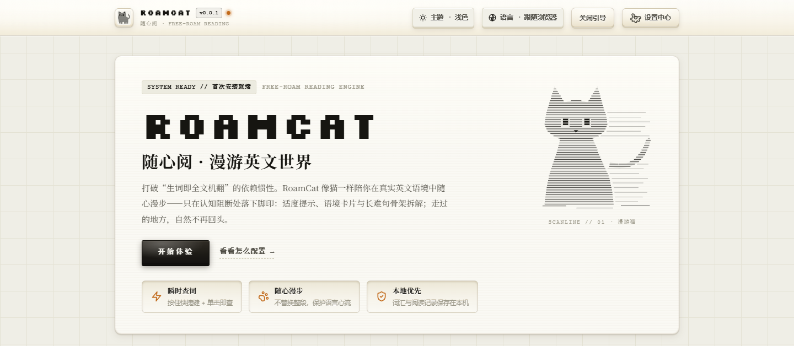
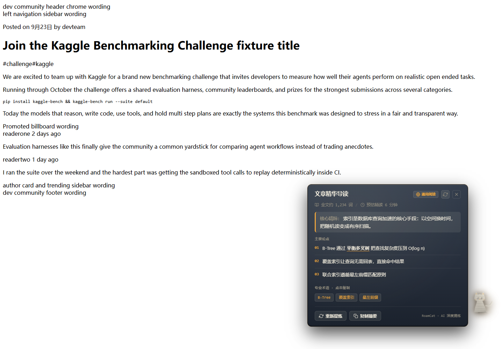
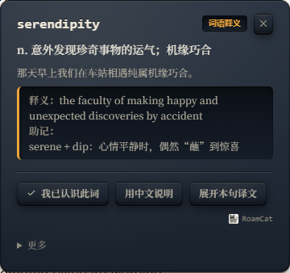
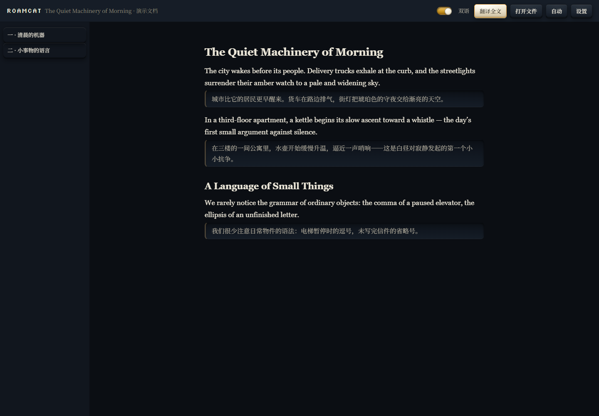
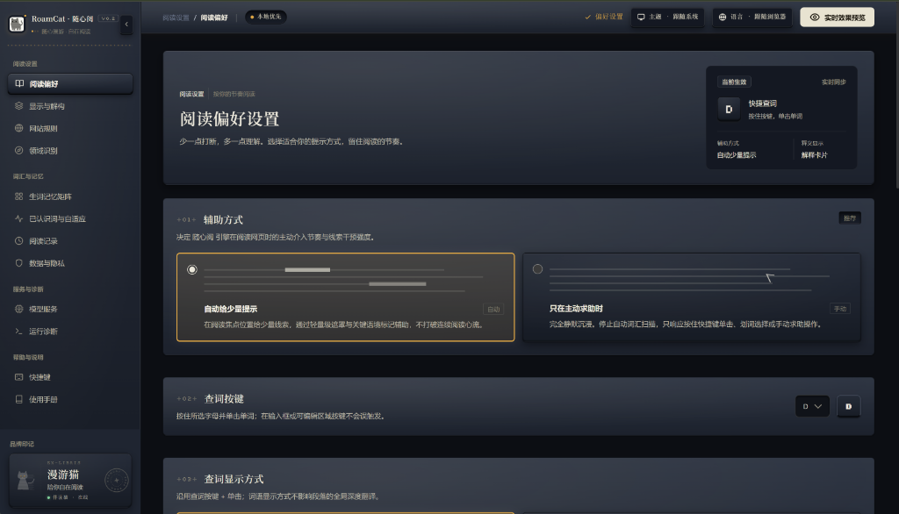
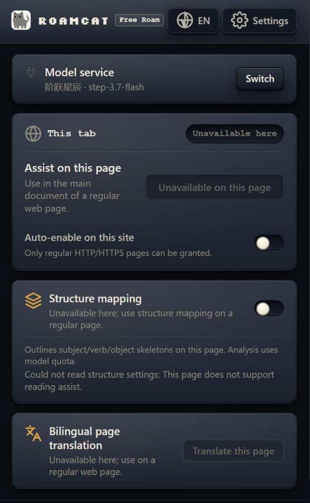

<p align="center">
  
</p>

<h1 align="center">RoamCat · 随心阅</h1>

<p align="center">
  <strong>A dual-mode reading extension that roams the English web like a cat</strong><br/>
  Bilingual mode turns English pages into side-by-side Chinese-English text;<br/>
  Reading Assistance keeps the original — sparse hints plus on-demand rescue.<br/>
  <em>Free, open-source and local-first — Manifest V3, for Chrome &amp; Edge 125+.</em>
</p>

<p align="center">
  <a href="LICENSE"></a>
  <a href="https://github.com/dapao-777/roamcat/releases"></a>
  <a href="https://github.com/dapao-777/roamcat/actions/workflows/ci.yml"></a>
  
  
</p>

<p align="center">
  <a href="README.zh-CN.md">中文文档</a> ·
  <a href="https://github.com/dapao-777/roamcat/releases">Download prerelease</a> ·
  <a href="roamcat-0.0.1/README.md">Product docs</a> ·
  <a href="roamcat-0.0.1/SPEC.md">Engineering spec</a> ·
  <a href="roamcat-0.0.1/docs/design-system.md">Design docs</a>
</p>

<p align="center">
  <picture>
    <source media="(prefers-color-scheme: dark)" srcset=".github/assets/banner-welcome-dark.png">
    
  </picture>
</p>

> **0.0.1 prerelease** — loaded via developer mode, not yet on any store. This project rebuilds, optimizes and repairs the open-source [RelyLess](https://github.com/rockythink/relyless); thanks to its author, Bilibili creator [停车拾穗](https://live.bilibili.com/392612).

**Local-first.** No servers operated, no telemetry, reading history off by default and gated per site. AI capability comes from a source you choose — a bundled local classification model, one of **28 bring-your-own API providers**, or a local connector that reuses your **ChatGPT / Grok / Antigravity** subscriptions.

**Bilingual interface.** Every surface — popup, options, welcome, reader, in-page widgets and the companion cat — switches between Chinese and English; `auto` follows the browser's UI language.

## 🌓 Two modes, one engine

| | 🌐 Bilingual Translation · primary | 📖 Reading Assistance · secondary |
|---|---|---|
| **Does** | Translates page English in place into Chinese-English pairs | Keeps the English; sparse hints plus on-demand rescue only |
| **Invoke** | Popup "Translate this page" or `Alt+Shift+T`; follows your reading position — never pre-translates the whole article in the background | Auto hints that taper off as you read; hold `D` + click to look up a word; select a phrase or passage for manual rescue |
| **Looks like** | Inline bilingual pairs in body text; tables and cards matched in place; navigation, sidebars and other page chrome get small inline translations | Lookup card / top-of-line glosses / sentence-deconstruction underlines |
| **Exit** | "Back to English" removes only extension-injected content, without rolling back site updates | Hints fade as you read — the goal is to stop needing them |

Failed units retry on a graded backoff (2.5s → 6s → 14s, classified by error code) before surfacing a manual "retry this passage" — transient rate limits no longer flash failure UI.

### 🐱 The companion cat

A Shadow DOM widget that perches at the page edge — reading switch, article digest, settings and shortcut entries; draggable and dockable, one per page, never injected unless enabled.

<p align="center">
  
  
</p>

### 🧭 Fluent on real pages

- **Site profiles** for developer haunts — GitHub, Reddit (old &amp; new), Hacker News, Stack Exchange, Discourse, dev.to (Forem), Lobsters: code blocks, diffs, file trees, vote and byline chrome stay out of reading blocks and translate as page furniture.
- **Long-sentence detection** flags ≥22-word sentences carrying subordinate clauses with a subtle amber underline — purely local, no model call.
- **Formula protection** keeps MathML / KaTeX / MathJax containers and inline `$…$` / `\(…\)` / `\[…\]` out of translation units.
- **Popup quick-switch**: the toolbar popup shows the active model service inline and expands to swap between subscription channels and saved APIs.

## 📚 Built-in reader

Opens **PDF and EPUB** files (or any pasted article) with the same bilingual engine — "Translate all" renders paragraph by paragraph at your reading position:

<p align="center">
  
</p>

## 🔌 Model services — your choice of source

| Source | What you get |
|---|---|
| **Bring-your-own API** | 28 providers across 8 protocols — OpenAI / DeepSeek / Gemini / Anthropic / xAI / OpenRouter / Ollama / Alibaba Cloud / Volcano Engine / Kimi / StepFun and more. Structured-output capability is probed first, then gracefully degraded. |
| **Subscription connector** | Local Native Messaging reuses your official CLI entitlements — Codex CLI (ChatGPT subscription), Grok CLI (SuperGrok / X Premium+), Antigravity `agy` (Google AI Pro / Ultra). No API key needed. |
| **Local model** | Bundled `Xenova/all-MiniLM-L6-v2` runs page-domain classification in an offscreen document + worker — fully offline, nothing to download. |

## 🔒 Local-first boundaries

- Reading history is off by default and opt-in per site; nothing is collected on incognito pages; API keys live only in `chrome.storage.local`.
- Keys never enter content scripts, diagnostic logs, or the connector; content scripts can only send **33 whitelisted message types** out of 74.
- All model output passes `gloss.mjs` structured validation before reaching the UI; custom API endpoints must be HTTPS (loopback excepted).

## ⚖️ How RoamCat compares

An honest look next to tools you may already know — RoamCat is not trying to be everything for everyone:

| | **RoamCat** | Immersive Translate | Relingo | 彩云小译 |
|---|---|---|---|---|
| **Approach** | Two modes: bilingual pairs *or* sparse assistance that keeps the original English primary | Full-page bilingual translation | Graded word highlights + look-ups | Page & selection translation |
| **Open source** | ✅ MPL-2.0 | ❌ closed | ❌ closed | ❌ closed |
| **Data path** | No vendor servers, no telemetry, history off by default | Text goes to the translation services you pick; vendor cloud features exist | Cloud account | Cloud service |
| **Model source** | 28 BYOK providers, a bundled local model, or reuse ChatGPT / Grok / Google CLI subscriptions | Built-in services + BYOK for select AI models | Built-in | Built-in |
| **Cost** | Free — you only pay your own API provider, if any | Freemium | Freemium | Freemium |
| **Platforms** | Chrome / Edge 125+ | Chrome, Edge, Firefox, Safari, mobile | Chrome, Edge | Chrome, Edge, apps |

If you want the most polished set-and-forget full-page translator on the most platforms, Immersive Translate is the mature choice. Pick RoamCat if you want the English original to stay in charge, want code you can audit, or would rather spend your existing AI subscriptions than buy another one.

Open-source neighbors worth a look: [kiss-translator](https://github.com/fishjar/kiss-translator) and [openai-translator](https://github.com/openai-translator/openai-translator). RoamCat itself is a rebuild of [RelyLess](#-acknowledgements-and-origin).

## 🎨 Design language

**Paper &amp; ink × pixels × soft skeuomorphism.** Cream paper `#faf9f4` + warm ink `#161511`, the Silkscreen pixel font and a scanline cat add a digital accent; controls are keycaps with physical feedback — buttons carry bottom-edge skirts and sink on press, toggles are milled ceramic beads, badges are engraved plates. The dark theme mirrors the same material language as **cool inkstone graphite**: slightly blue-tinted canvas `#0b0e13`, warm ivory ink `#ece7d9`, porcelain-white primary keys, amber `#f0a63c` reserved for semantic accents.

<details>
<summary><strong>Design spec at a glance</strong></summary>

| Item | Spec |
|---|---|
| UI body text | System sans (Segoe UI / PingFang SC / Microsoft YaHei), 14–15px |
| Reading text &amp; headings | Serif (Noto Serif SC → SimSun → Georgia), body 15px / 1.6 line-height |
| Brand / digits / keycaps | Silkscreen pixel font (bundled woff2, works offline) |
| Tags / POS / diagnostic codes | ui-monospace, 13px |
| Palette | Paper `#faf9f4` + ink `#161511` in light (ink doubles as accent); graphite `#0b0e13` + ivory `#ece7d9` + amber `#f0a63c` in dark |
| Logo &amp; marks | Scanline cat (`icons/roamcat.svg` + `roamcat-cat-ink.svg`, `fill="currentColor"`), dot-wave band, pixel spark |
| Motion | 80 / 160 / 280 / 440ms tiers + `linear()` spring curves, honors `prefers-reduced-motion` |

</details>

All visual decisions collapse into a single set of `--rc-*` tokens in `src/styles/tokens.css`; in-page components inject the same tokens via Shadow DOM + `design.js`, with zero pollution of site styles. Full spec in the [design system doc](roamcat-0.0.1/docs/design-system.md) (中文); logo usage, palette ratios and voice rules in the [brand guidelines](roamcat-0.0.1/docs/brand.md) (中文) — or open the rendered [brand board](roamcat-0.0.1/docs/brand-board.html) for every swatch, typeface and material sample.

<p align="center">
  <picture>
    <source media="(prefers-color-scheme: dark)" srcset=".github/assets/options-dark.png">
    
  </picture>
</p>

<p align="center">
  
  
</p>

## 🚀 Quick start

Requires Chrome or Edge **125+**.

**A · Release zip (fastest, no build)** — Download `roamcat-0.0.1-extension.zip` from [Releases](https://github.com/dapao-777/roamcat/releases), unzip, then `chrome://extensions` → enable Developer mode → "Load unpacked" → select the unzipped `extension` directory. The zip has no fixed key injected, so the extension ID is derived from the install path — if you use the subscription connector, bind it to the actual ID during its install flow.

**B · Build from source (recommended for development; fixed extension ID)**

```sh
npm ci
npm run build    # → dist/extension (dev build, manifest gets a fixed key)
```

Load **`dist/extension`**. The dev-build ID is pinned by `build/extension-key.json` (currently `afpeggkplomdjjiemgajjgcajieincng`) — moving the build directory does not change the ID, so the connector never needs reinstalling. After changing source, rerun `npm run build`, hit reload on the extension page, then refresh open tabs.

**C · Load the source directory directly (no build)** — Load **`roamcat-0.0.1/extension`**. Note: an unpacked extension's ID is bound to its directory path — moving the directory changes the ID and breaks the local connector.

**Optional · subscription connector** — let the extension call your locally signed-in ChatGPT / Grok / Antigravity CLIs:

```sh
node roamcat-0.0.1/connector/install.mjs --extension-id <extension-id> --backend grok
```

## 🏗️ Architecture

```
┌─────────────────────────────── browser ────────────────────────────────┐
│ Content scripts (nine static entries, document_idle)                   │
│   design.js → i18n.js → reading-style.js → content-ui.js →             │
│   pet-quotes.js → complexity.js → formula.js → site-profiles.js →      │
│   content.js                                                           │
│   · i18n.js: zh/en runtime dictionary shared by all surfaces           │
│   · content-ui.js: lit-html in-page UI layer (build artifact, in repo) │
│   · content.js: reading-area detection / annotation / lookup /         │
│     deconstruction / bilingual translation engine                      │
│ Dynamically registered (chrome.scripting, on demand)                   │
│   · floating-pet.js companion cat · auto-start.js auto-enable          │
├────────────────────────────────────────────────────────────────────────┤
│ Service Worker: background.js (ES module, stateless)                   │
│   74 message routes · settings validation & migration ·                │
│   cache / concurrency / watchdog · subscription ports ·                │
│   uiLang broadcast to every tab                                        │
├────────────────────────────────────────────────────────────────────────┤
│ Extension pages: popup / options / welcome / reader                    │
│   Lit apps under src/, built by Vite into dist/extension/ui/           │
│ Offscreen document: local-inference (ONNX MiniLM domain classifier,    │
│   disposed after 5 min idle)                                           │
├────────────────────────────────────────────────────────────────────────┤
│ Local connector (Node.js 20+, Native Messaging stdio frame protocol)   │
│   host.mjs + codex.mjs / grok.mjs / antigravity.mjs                    │
└────────────────────────────────────────────────────────────────────────┘
```

Engineering highlights:

- **Trust boundary**: extension pages (trusted) → content scripts (33 whitelisted message types) → model output (structured validation before UI) → page DOM (enters prompts as data, `SOURCE_DATA_INSTRUCTIONS`).
- **Single source of truth for the message protocol**: `extension/message-protocol.js` registers all 74 message types with payload parsers; registry-to-handler correspondence is enforced by contract tests.
- **Bilingual UI runtime**: `extension/i18n.js` is the single zh/en dictionary (~1,600 aligned keys) consumed by Lit pages, classic scripts and the service worker; content scripts that cannot reach `chrome.storage` sync the language preference through `STATE_GET` / `SS_REFRESH` snapshots.
- **No in-memory state assumptions in the Service Worker**: cross-call state lives in `chrome.storage.local/session` and IndexedDB; writes are serialized; long operations carry watchdogs.
- Full spec in [`roamcat-0.0.1/SPEC.md`](roamcat-0.0.1/SPEC.md) (中文).

## 🗺️ Roadmap

Planned directions — may change with progress and feedback, no promises:

- One-click switching between primary and secondary modes while reading.
- Reading assistance on more substrates (secondary-mode direction): PDF, e-readers.
- `host_permissions` changed from all-sites to `optional_host_permissions` requested on demand.
- Chrome Web Store / Microsoft Edge Add-ons publishing (copy and per-permission justifications ready in [`CHROMEWEBSTORE.md`](roamcat-0.0.1/CHROMEWEBSTORE.md), 中文).

## ❓ FAQ

**Is RoamCat free?**
Yes — MPL-2.0 open source, no accounts, no paid tier, no telemetry. You only pay if you choose to connect a paid API yourself; the bundled local model and the subscription connector cost nothing.

**Does RoamCat send my reading data anywhere?**
There are no RoamCat servers. Reading history is off by default and opt-in per site; page text leaves the device only when you invoke a model feature, and goes directly to the provider you configured.

**Which browsers are supported?**
Chrome and Edge 125+ on desktop (Manifest V3). Firefox and Safari are not currently supported.

**Can it translate an entire page?**
Yes — Bilingual mode inserts Chinese next to each English paragraph at your reading position. Reading Assistance mode instead keeps the page fully English and only adds sparse hints that fade as you read.

**Does it work with PDFs and EPUBs?**
Yes — the built-in reader opens local PDF/EPUB files and pasted articles with the same bilingual engine.

**Which AI models can I use?**
28 bring-your-own providers (OpenAI, DeepSeek, Gemini, Anthropic, xAI, OpenRouter, Ollama, Alibaba Cloud, Volcano Engine, Kimi, StepFun…), a bundled local model for on-device domain classification, or a local connector that reuses your signed-in ChatGPT / Grok / Antigravity CLI subscriptions — no API key needed.

**Who is RoamCat for?**
Chinese-speaking readers who live on English sites — docs, GitHub, Reddit, Hacker News — and want help that fades as their reading improves, or side-by-side bilingual text when it doesn't.

## 🛠️ Development

Requires Node.js 20.11+ (verified on Node 24). Static checks and unit tests are zero-dependency:

| Command | What it does / gates |
|---|---|
| `npm run build` · `npm run build:watch` | Vite dev build → `dist/extension` (fixed key injected) |
| `npm run verify` | Module-graph gates R1–R11: load contract / no cycles / layering / file headers / manifest resources |
| `npm run verify:sites` | Site-profile e2e: fixtures routed by real URL into Edge asserting `inspect()` (`--live` rechecks real sites) |
| `npm test` | 179 unit tests (`node --test`, zero-dep, Node 18+) |
| `npm run verify:build` | Build-artifact gates: byte comparison + real Edge load smoke test |
| `npm run verify:ui` | 77-check UI sweep: every page &amp; widget, light+dark, zh+en assertions, screenshots → `preview/` |
| `npm run verify:pet` | 65-check companion-cat sweep: every floating button clicked for real |
| `npm run gen:tokens` · `node tools/check-dict.cjs` | Regenerate `extension/design.js` from tokens · zh/en dictionary parity check |

Local browser regression (requires Playwright + local Edge, output to `preview/`):

```sh
node tools/audit-extension.cjs    # main regression
node tools/verify-ui-all.cjs      # UI layout, light/dark themes, zh/en language assertions
```

Please read [CONTRIBUTING.md](CONTRIBUTING.md) (中文) before contributing; report security issues privately per [SECURITY.md](SECURITY.md).

<details>
<summary><strong>Repository layout</strong></summary>

| Path | Contents |
|------|----------|
| [`roamcat-0.0.1/extension/`](roamcat-0.0.1/extension/) | Manifest V3 extension source layer: background, content scripts, `i18n.js` zh/en runtime, domain modules, local inference, icons/fonts/_locales, plus the `ui/` modules and styles shared by the Lit apps (classic page sources are replaced by build output). |
| [`roamcat-0.0.1/connector/`](roamcat-0.0.1/connector/) | Native Messaging host + adapters for the three subscription CLIs: Codex / Grok / Antigravity. |
| [`src/`](src/) | Vite + Lit page apps and shared components; `src/content-ui` is the in-page lit-html render layer; the `@ext` alias points at the extension source directory. |
| [`build/`](build/) | Build-time scripts: extension copy/manifest transform plugin, design-token generation, dev extension key; `vite.content-ui.config.mjs` builds the content-ui IIFE. |
| `dist/extension/` | Build output (not committed) = source-layer copy − `REPLACED_BY_BUILD` + Vite page artifacts + transformed manifest. |
| [`tools/`](tools/) | Module-graph gates, unit tests, build-artifact gates, local browser regression scripts. |

</details>

## 📖 Docs

| Doc | Contents |
|-----|----------|
| [Product docs](roamcat-0.0.1/README.md) (中文) | Feature details, install, model-service configuration, and privacy notes |
| [Design system](roamcat-0.0.1/docs/design-system.md) (中文) | Design vocabulary, typography, color &amp; material, motion, component spec |
| [Brand guidelines](roamcat-0.0.1/docs/brand.md) (中文) · [Brand board](roamcat-0.0.1/docs/brand-board.html) | Logo usage, brand palette, typography roles, voice; open the board locally to see it rendered |
| [Engineering spec](roamcat-0.0.1/SPEC.md) (中文) | Message protocol, storage model, security boundaries, test gates |
| [Privacy policy](roamcat-0.0.1/PRIVACY.md) | Full disclosure of data handling and permission usage |
| [Store checklist](roamcat-0.0.1/CHROMEWEBSTORE.md) (中文) | Chrome Web Store copy and per-permission justifications |
| [Changelog](CHANGELOG.md) | Version history (Keep a Changelog format) |
| [Contributing](CONTRIBUTING.md) (中文) · [Code of conduct](CODE_OF_CONDUCT.md) · [Security policy](SECURITY.md) | Collaboration and disclosure processes |

## 🙏 Acknowledgements and origin

RoamCat is a refactor of [RelyLess](https://github.com/rockythink/relyless) — this project rebuilds, optimizes, and repairs it on top of its open-source code and product ideas (the dual-mode engine, the Vite + Lit page build chain, whole-page bilingual translation, the subscription connector, and more were built on that foundation).

The original author is Bilibili creator **[停车拾穗](https://live.bilibili.com/392612)** — thanks for the open-source work. The upstream RelyLess repo shipped without a license; this repo's own code is released under MPL-2.0, and if upstream adds license terms, this project will comply.

## License

Original code is [MPL-2.0](LICENSE). Third-party assets — word-frequency data (CC BY-SA 4.0), models and runtimes (Apache-2.0 / MIT), icons (MIT) — keep their own licenses; see [NOTICE.txt](roamcat-0.0.1/NOTICE.txt).
